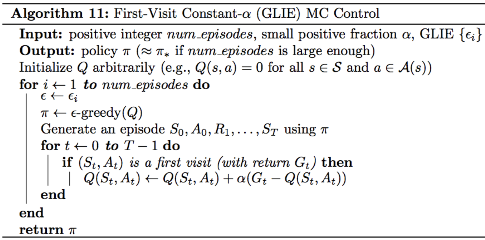
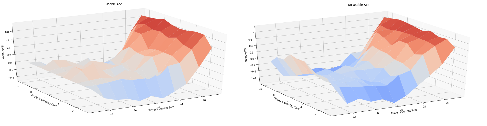
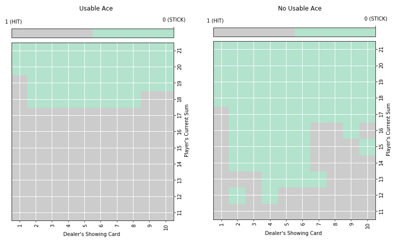

# constant-α Monte Carlo Control for the game of Blackjack

This is my implementation of constant-α Monte Carlo Control for the game of Blackjack using Python & OpenAI gym's **Blackjack-v0** environment.
OpenAI's main code for how the game environment works can be found [here](https://github.com/openai/gym/blob/master/gym/envs/toy_text/blackjack.py).

The pseudocode for constant-α Monte Carlo Control is as follows:

## Repository 

This repository contains:
* **mc_control.py** : Complete code for ALL steps of the MC Control implementation
* **plot_utils.py** : helper codes provided by Udacity's [Deep Reinforcement Learning Nanodegree github repository](https://github.com/udacity/deep-reinforcement-learning)
                      for (i)obtaining state-value functions from Q and (ii)sophiscated plotting of the results 

## Model Outputs

At the end, MC control aims to output the following:

* **1. Optimal Policy**
* **2. Optimal Q** (action-value function table) 

## List of Hyperparameters used:

* alpha (content image weight) = **0.02**
* gamma (discount rate) = **0.9**  
* number of episodes = **500000**

## Results

Here are the results I obtained after executing MC Control using the above hyperparameteres:
- State-value Functions for vs. Current Sum of Player's Cards and Dealer's Face-up Card

Looking at the results, some observations can be made:
* For both cases, the worst state to be in for the player is to have a sum of around 16.
* For both cases, state-values increase linearly as the player's sum increases from 16 to 22.
* If Player has a Usable Ace, Dealer's face-up card seems to not matter much for the state value.
* If Player does NOT have a Usable Ace, state-values seems to fluctuate depending on Dealer's face-up card.
For example, if Player's sum is between 16 and 22, the state-values are higher when Dealer's card ranges from 6 to 9.

- Generated Optimal Policy (Hit: Draw a new card, Stick: Stop drawing a new card) 

The above plots resemble the true optimal policy plots shown in the reinforcement learning [textbook](http://go.udacity.com/rl-textbook)!

## Sources

I referenced Udacity's Deep Reinforcement Learning Nanodegree github repository for building & debugging the final model :

* https://github.com/udacity/deep-reinforcement-learning

